# 🌾 FarmTech Solutions – Sistema de Irrigação Inteligente com ESP32 e Banco SQL


## 📌 Visão Geral
Este projeto simula um sistema de **irrigação inteligente** utilizando sensores agrícolas, um microcontrolador **ESP32**, e armazenamento em banco **SQL**. A simulação é feita na plataforma **Wokwi**, e os dados coletados são manipulados com **Python**, permitindo análises, visualizações e controle automatizado da irrigação.

## ⚙️ Funcionalidades
✅ Leitura dos sensores simulados  
✅ Armazenamento dos dados em banco SQL  
✅ Operações CRUD implementadas  
🚀 Extras opcionais: Dashboard e integração com API de clima  

## 🗂️ Estrutura do Repositório

```plaintext
📁 /
├── 📄 README.md
├── 📁 /simulador/  → Codigo para utilizar no WokWi on-line.
│   ├── 📁 /api/ → Ir alem. Codigo phyton que consome API.
│   ├── 📁 /images/ → Imagens usadas no Readme.
│   ├── diagram.json    → Formato JSON, que renderiza o Wokwi.
│   ├── libraries.txt   → Bibliotecas utilizadas no projeto.
│   ├── main.ino        → Codigo C++ da placa ESP32.
├── 📁 /sistema/ → Todas as funcionalidades do nosso sistema.
|   ├── 📁 /config/     → Arquivo que tem a conexao da base de dados SQL.
|   ├── 📁 /dashboard/  → Ir alem. Codigo phyton que gera os graficos.
|   ├── 📁 /files/      → Arquivos de entrada ou saida do sistema gerados.
|   |   ├── registrosESP32.txt → Registros gerados pela placa ESP32, para entrada em lote no sistema.
|   |   ├── 
|   ├── 📁 /scripts/ → Usado para manutencao da base de dados.
|   |   ├── contador_leituras.sql -> Select que contabiliza as leituras por sensor (nao usado no sistema).
|   |   ├── droptables.sql        -> Apaga as tabelas.
|   |   ├── insert.sql            -> Insere uma quantidade de dados (Mock).
|   |   ├── relacionamento.sql    -> Select que mostra alguns relacionamentos (nao usado no sistema).
|   |   ├── scrpit.sql            -> Cria as tabelas novamente.
|   ├── db.py         -> Conexao com a base de dados e algumas funcoes default de dados.
|   ├── editar.py     -> Edita Leituras do sensor.
|   ├── excluir.py    -> Excluir leituras do sensor.
|   ├── exibir.py     -> Exibe as leituras do sensor.
|   ├── inserir.py    -> Insere manualmente leituras do sensor.
|   ├── main.py       -> Inicio do programa e menus.
|   ├── simulador.py  -> Insere via texto(lote) ou formato especifico da saida da placa ESP32.
```
## 🔗 Links Úteis
- 🤖 [Projeto no Wokwi](https://wokwi.com/projects/430970377652249601) – Simulador online de circuitos  
- ▶️ [Demonstração no YouTube](https://www.youtube.com/) – Vídeo demonstrando o funcionamento do projeto

## 👥 Alunos
- Nome: Felipe Balthazar de Almeida
- Nome: Fernando Gomes da Silva
- Nome: Guilherme Urbinatti
- Nome: Vinicius Burchert Vilas Boas

## 📝 ATIVIDADES
### Entrega 1: Sistema de Sensores e Controle com ESP32
├── 📁 /simulador/
- PROJETO
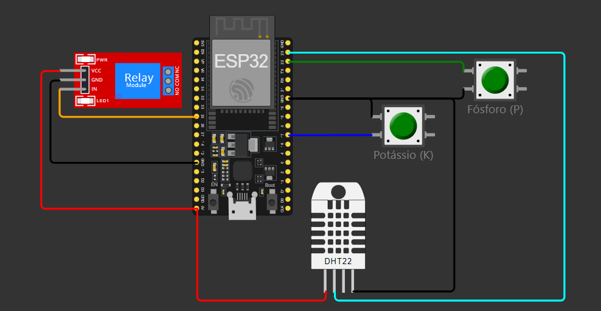

- LOG`s
<table>
  <tr>
    <td>
      <h4>Bomba Ativada - Umidade <= 40%</h4>
      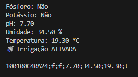
    </td>
    <td>
      <h4>Log 2 Bomba Desativada - Humidade > 40%</h4>
      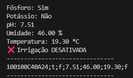
    </td>
  </tr>
</table>

- Umidade abaixo de 40%, deve ativar a bomba

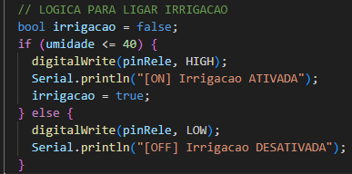

### Entrega 2: Armazenamento de Dados em Banco SQL com Python
O desenvolvimento do CRUD, focou em gerar massa de dados para 1 Produto e uma fazenda, para conseguir entregar os graficos da atividade extra. - [SCRIPT](./sistema/scripts/contador_leituras.sql)
-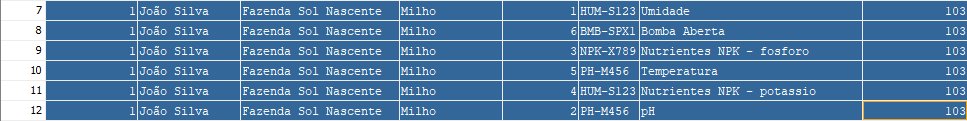

#### Como chegar nesse resultado?
1) Alterar o arquivo - [Config](./sistema/config/config.json)
2) Raiz de ./sistema rodar: ```python3 main.py ```
3) Menu: ``` 0. Reiniciar o banco de dados ```
4) Menu: ``` 15. Insere via arquivo (Conjunto de Leituras) ```

#### Justificativa da Estrutura de Dados e Relação com o MER
- No código, os dados dos sensores são recebidos como uma linha de texto, separados por ponto e vírgula, e depois convertidos para os tipos adequados. Cada leitura é armazenada como um registro separado, com identificação do sensor, valor e data/hora.
- Essa estrutura reflete diretamente o MER da Fase 2, onde a entidade LeituraSensor relaciona sensores, valores e timestamps. A abordagem segue o modelo normalizado, facilitando consultas e manutenção, além de garantir flexibilidade para incluir novos sensores e medições.
- Assim, a escolha da estrutura atende à organização, integridade e escalabilidade previstas no MER, facilitando o processamento e armazenamento dos dados de sensores.

[DER - FASE 2](https://github.com/TeamFiapAI/fase2_Cap-1/blob/main/modelo/der.png)
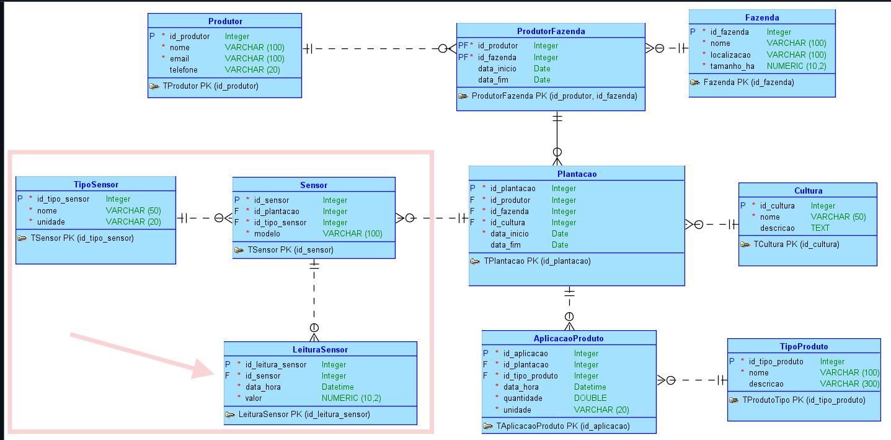


### Entrega 3.1: Dashboard em Python para Visualização dos Dados (IR ALÉM)
<table>
  <tr>
    <td>
      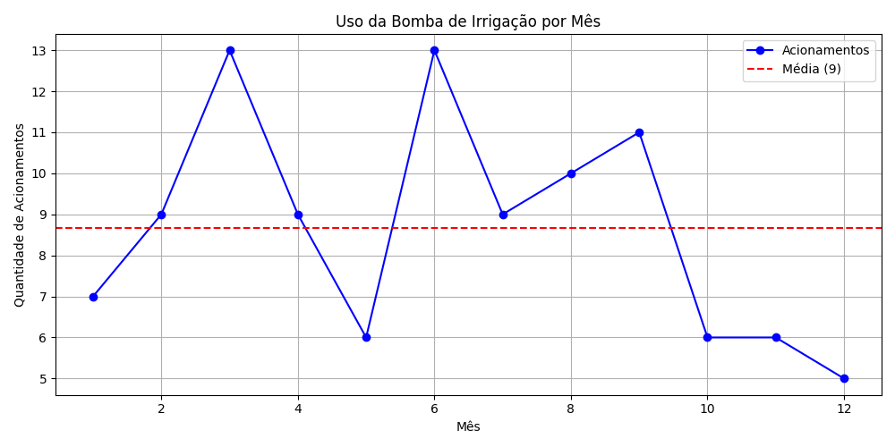
    </td>
    <td>
      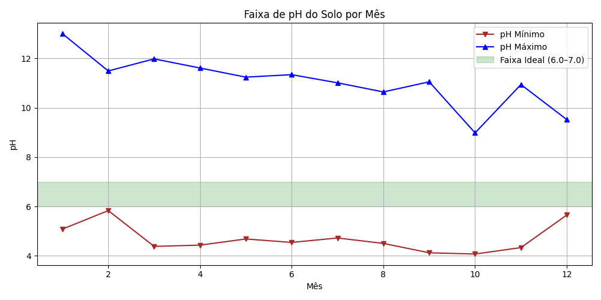
    </td>
  </tr>
    <tr>
    <td>
      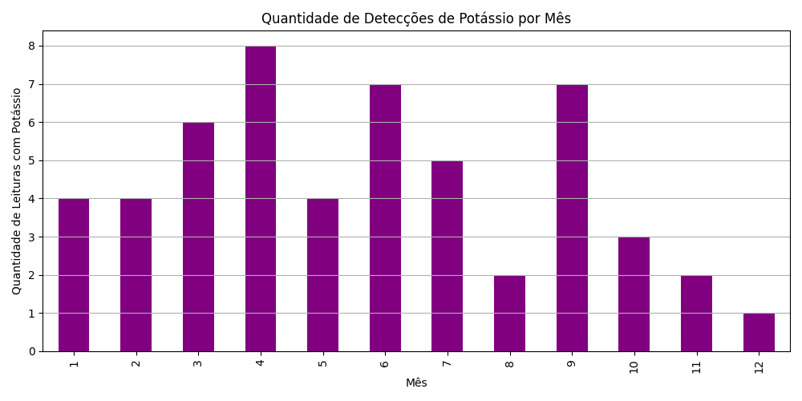
    </td>
    <td>
      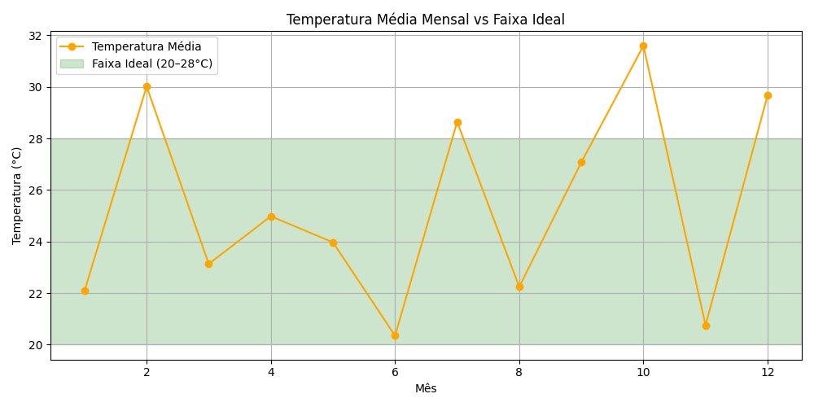
    </td>
  </tr>
</table>

### Entrega 3.2: Integração Python com API Pública (IR ALÉM)
 Temperatura baixa não permite abrir irrigacão.

 [Código Consumo API](./sistema/api/api.py)
 1) MENU: ``` 171. * EXTRA - Inserir Leitura Sensor via API ```
 2) Entrou - TRUE
 3) Temperatura estava 17.5 (baixa)
 4) Alterou o valor para - False
 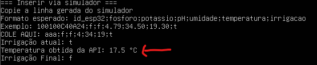