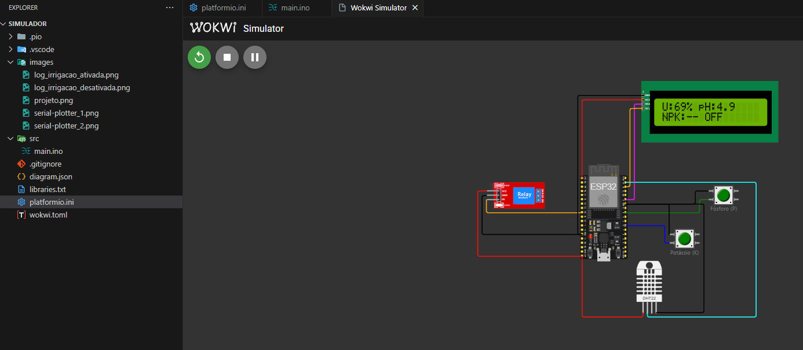
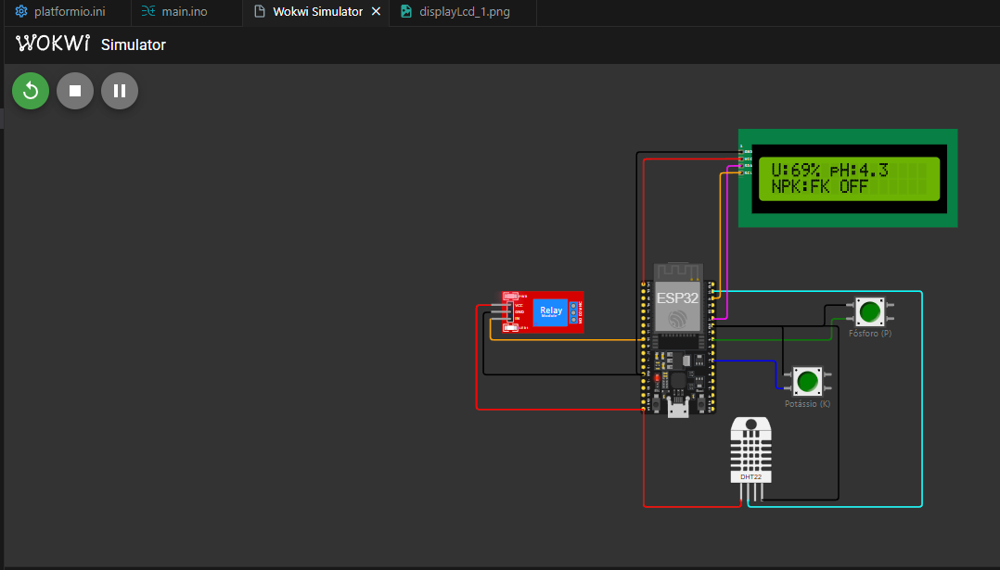
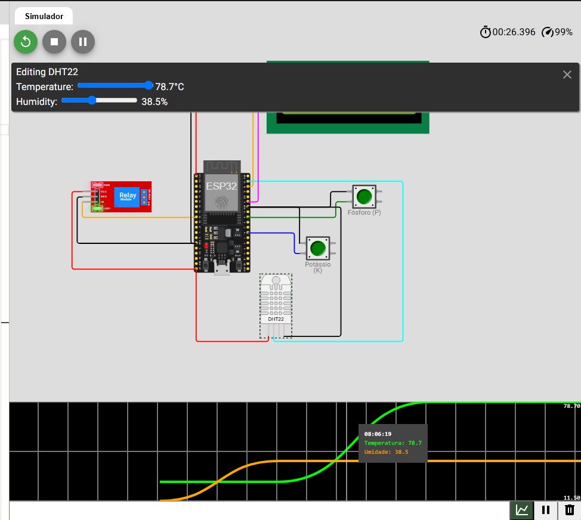
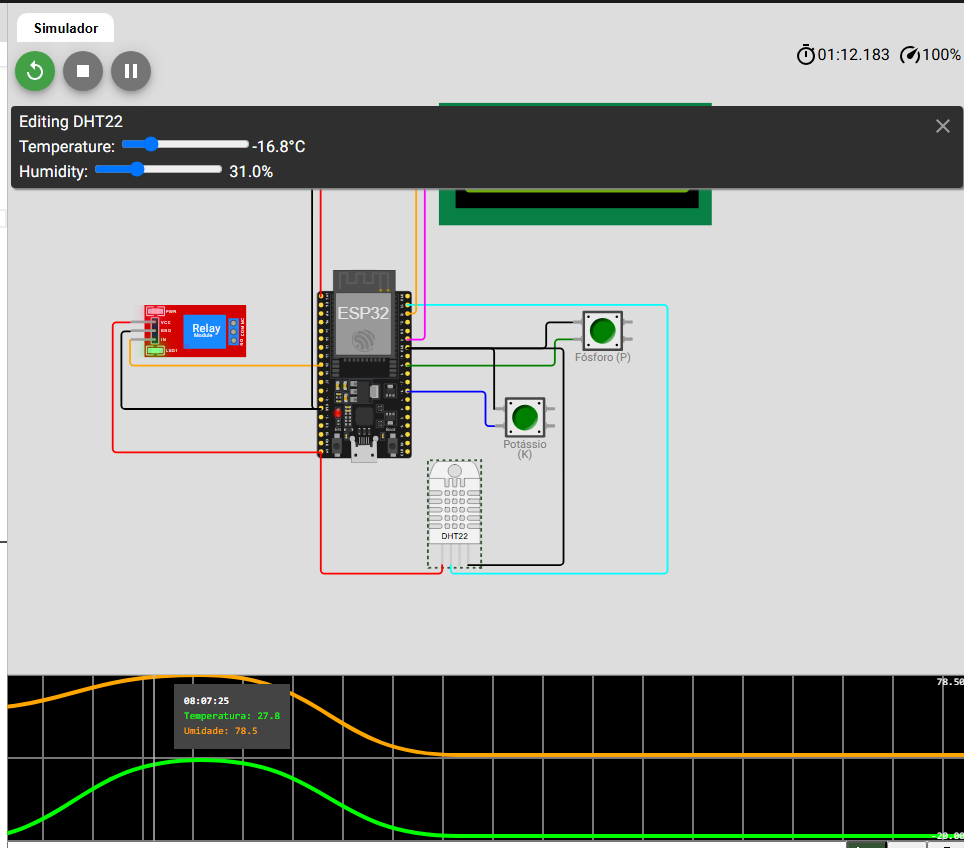

# FASE 4 – Integração de Display LCD, Serial Plotter e Otimização de Memória no ESP32
Nesta fase, o projeto passou por uma evolução significativa com a implementação dos seguintes itens:

### 1. 📟 Adição de Display LCD (I2C) no Wokwi

Foi adicionado um display LCD 16x2 com barramento I2C conectado ao ESP32, utilizando os pinos padrão SDA (21) e SCL (22). O display exibe em tempo real as principais métricas monitoradas pelo sistema:

- Umidade relativa do ar (%)
- pH
- Nível de nutrientes (fósforo e potássio)
- Status da irrigação (ativa/inativa)

#### Exemplo 1
```
Umidade: 69%
pH: 4.9
Fosforo(P): -  (desativado)
Potassio(K): - (desativado)
Bomba: OFF
```
> 

#### Exemplo 2
```
Umidade: 69%
pH: 4.9
Fosforo(P): -  (desativado)
Potassio(K): - (desativado)
Bomba: OFF
```
> 

#### Exemplo 3
```
Umidade: 28%
pH: 6.1
Fosforo(P): P  (ativado)
Potassio(K): K (ativado)
Bomba: ON
```
> 

### 2. 📈 Monitoramento via Serial Plotter

O código foi adaptado para imprimir no Serial os dados lidos pelos sensores. Isso permite a utilização do Serial Plotter do Wokwi para visualizar em tempo real as variações de Temperatura e Umidade .

[Projeto WokiWi](https://wokwi.com/projects/434089547667747841)

Variáveis plotadas:
- Temperatura
- Umidade


#### Exemplo 1
```
Temperatura: 78.7
Umidade: 38.5%
Obs: Grafico mostrando as variaveis.
```
> 
#### Exemplo 2
```
Temperatura: -16.8
Umidade: 31.0%
Obs: Grafico mostrando a queda.
```
> 


### 3. ♻️ Otimização de Memória no Código ESP32

Realizamos uma revisão no código C++ para garantir melhor performance e economia de memória. As seguintes ações foram tomadas:

- Uso de tipos de dados apropriados:
  - float somente onde necessário (por exemplo, leituras de sensores analógicos).
  - uint8_t para variáveis de controle e flags.
  - char[] no lugar de String para mensagens fixas.
- Declarações const utilizadas para valores estáticos.
- Comentários inseridos explicando cada otimização diretamente no código-fonte.

Trecho otimizado com comentários:
```cpp
// Utilizamos uint8_t para economizar memória com valores entre 0-255
uint8_t irrigationStatus = 0; 

// pH representado como float pois requer precisão de casas decimais
float phLevel = 6.7;

// Mensagem fixa otimizada usando array de char
const char irrigacaoMsg[] = "Irrigacao: Ligada";
```

## 🧪 Testes Realizados

- ✅ Display mostra dados corretamente ao ligar o sistema
- ✅ Bomba é acionada ao detectar valores críticos
- ✅ Gráficos no Serial Plotter refletem os valores lidos


### 🧠 Conclusão
A Fase 4 agregou melhorias visuais e técnicas ao projeto, permitindo o monitoramento em tempo real tanto no dispositivo (via display LCD) quanto virtualmente (via Serial Plotter).

### 🔁 Pull Request
👉 [Link do Pull Request](https://github.com/TeamFiapAI/farmtech-2/pull/1)